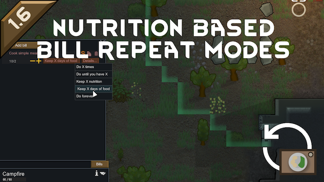

# Nutrition Based Bill Repeat Modes

This RimWorld mod adds several bill repeat modes for cooking bills:
- Do until you have X nutrition.
- Do until you have X days of food.

## Supported RimWorld versions
- 1.6

## Supported languages
- English
- Russian

## Mod compatibility
This mod may be incompatible with other mods which add custom bill repeat modes. Specific mods were not tested yet.

## FAQ
**Q**: Is this mod save game compatible?  
**A**: The mod can be safely added to existing games. The mod can be removed from existing games as long as there are no bills with modded repeat modes present.

---

Built with [Unity Mod Studio](https://marketplace.visualstudio.com/items?itemName=darkdaskin.UnityModStudio2022).